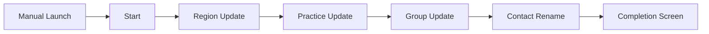

# Automation Flowcharts - CBO Setup RPG ID Chain Reset

## Trigger Execution Flow

## Decision/Validation Representation
The flow has no explicit Decision elements, but each Record Update contains implicit filter checks:
- Region update only executes against records where `Name = Global Region`
- Practice update only executes against records where `Name = Global Practice`
- Group update only executes against records where `Name = Global Group`
- Contact rename only executes where `FirstName = Zack` and `LastName = Mundy`

If no records match, the flow continues without explicit fault branching.
