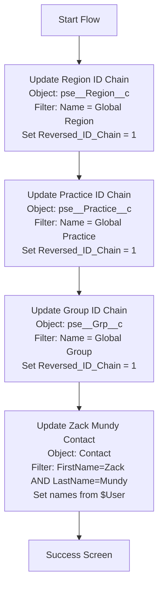
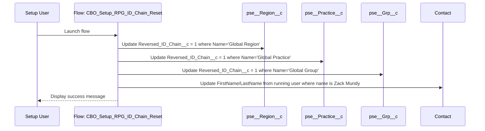
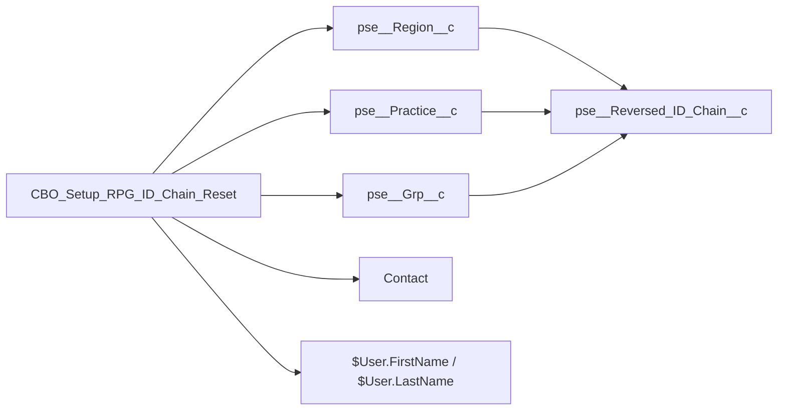

# Mermaid Diagrams - CBO Setup RPG ID Chain Reset

## End-to-End Process Flow

```mermaid
flowchart TD
    A[Start Flow] --> B[Update Region ID Chain\nObject: pse__Region__c\nFilter: Name = Global Region\nSet Reversed_ID_Chain = 1]
    B --> C[Update Practice ID Chain\nObject: pse__Practice__c\nFilter: Name = Global Practice\nSet Reversed_ID_Chain = 1]
    C --> D[Update Group ID Chain\nObject: pse__Grp__c\nFilter: Name = Global Group\nSet Reversed_ID_Chain = 1]
    D --> E[Update Zack Mundy Contact\nObject: Contact\nFilter: FirstName=Zack AND LastName=Mundy\nSet names from $User]
    E --> F[Success Screen]
```

## Sequence Diagram

```mermaid
sequenceDiagram
    participant U as Setup User
    participant F as Flow: CBO_Setup_RPG_ID_Chain_Reset
    participant R as pse__Region__c
    participant P as pse__Practice__c
    participant G as pse__Grp__c
    participant C as Contact

    U->>F: Launch flow
    F->>R: Update Reversed_ID_Chain__c = 1 where Name='Global Region'
    F->>P: Update Reversed_ID_Chain__c = 1 where Name='Global Practice'
    F->>G: Update Reversed_ID_Chain__c = 1 where Name='Global Group'
    F->>C: Update FirstName/LastName from running user where name is Zack Mundy
    F-->>U: Display success message
```

## Dependency Graph

```mermaid
graph LR
    Flow[CBO_Setup_RPG_ID_Chain_Reset] --> O1[pse__Region__c]
    Flow --> O2[pse__Practice__c]
    Flow --> O3[pse__Grp__c]
    Flow --> O4[Contact]
    Flow --> GV[$User.FirstName / $User.LastName]
    O1 --> F1[pse__Reversed_ID_Chain__c]
    O2 --> F1
    O3 --> F1
```
